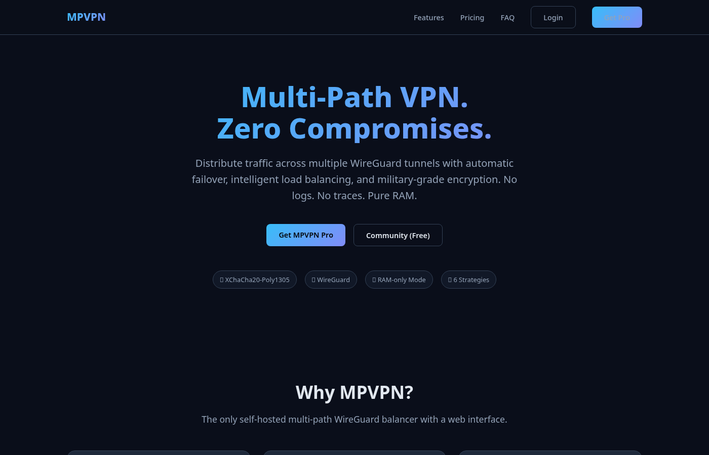
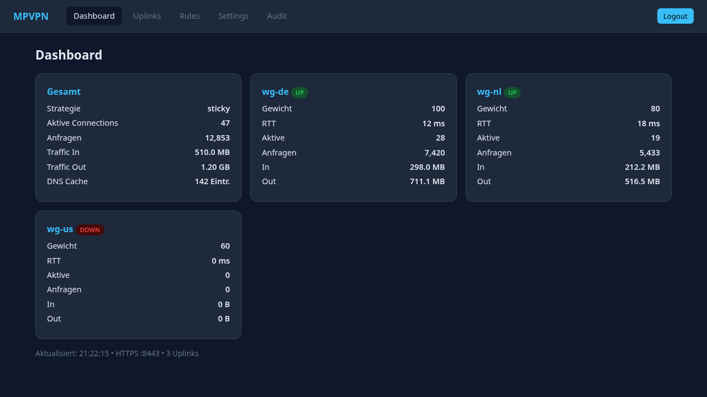
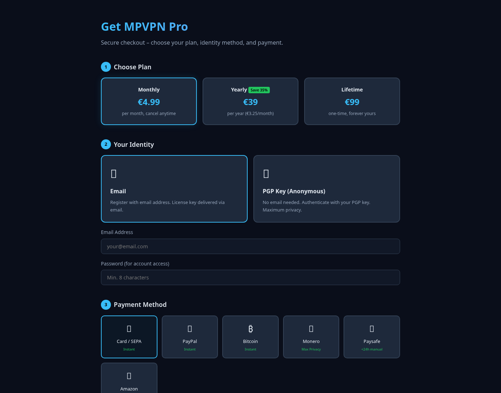
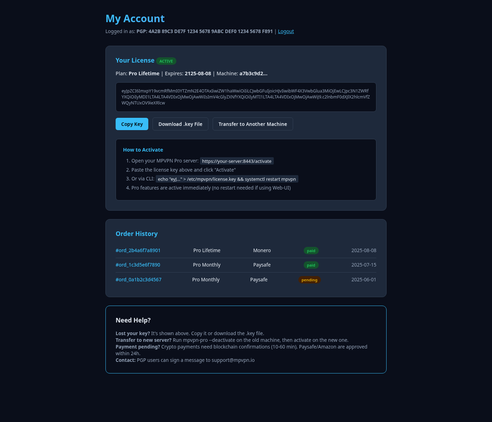
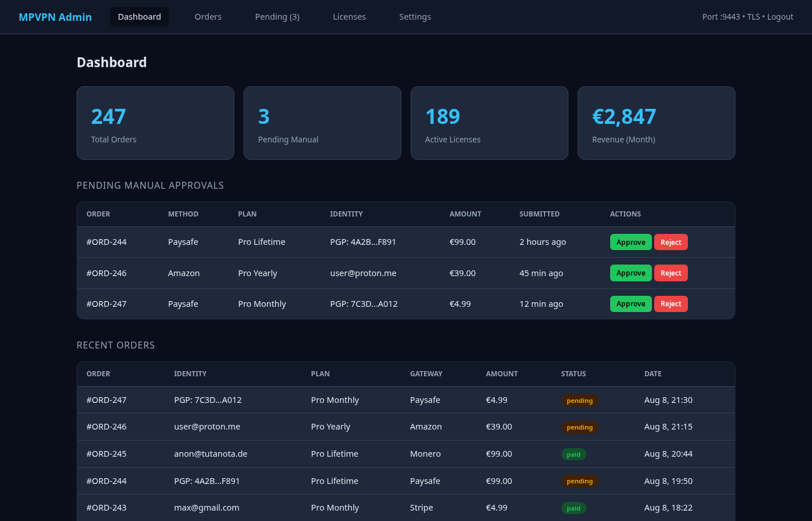
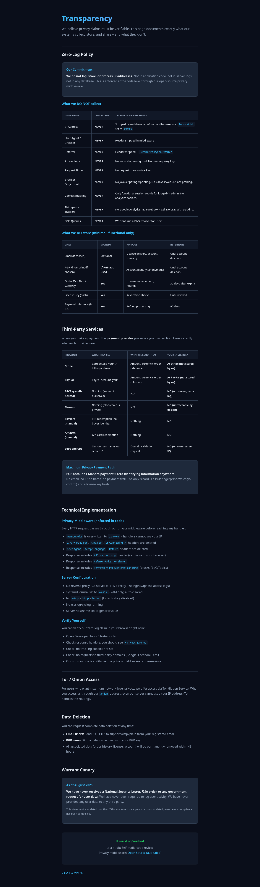

<div align="center">

# MPVPN

### Multi-Path WireGuard VPN Load-Balancer

**Distribute traffic across multiple WireGuard tunnels.**<br>
Automatic failover. Intelligent load balancing. Military-grade encryption.<br>
No logs. No traces. Pure RAM.

---

### 🚀 Coming Soon

**[mpvpn.net](https://mpvpn.net)**

---

</div>

## Screenshots

### Landing Page


### MPVPN Dashboard (Status & Metrics)


### Checkout (Email or PGP Anonymous + Payment)


### Customer Portal (License Key + Orders)


### Admin Panel (Order Management)


### Transparency (Zero-Log Policy)


---

## What is MPVPN?

MPVPN is a self-hosted, userspace multi-path WireGuard VPN load-balancer. It distributes outgoing traffic across multiple VPN tunnels simultaneously – giving you redundancy, speed, and privacy in one package.

Everything runs in userspace (gVisor netstack + wireguard-go). No kernel modules, no nftables, no fwmark hacks. Just a single static binary.

---

## Features

### Networking & Load Balancing

| Feature | Description |
|---------|-------------|
| **Multi-Path Tunneling** | Route traffic across 2-10+ WireGuard tunnels simultaneously |
| **6 Balancing Strategies** | Sticky, Weighted Round-Robin, Least Connections, Lowest RTT, Failover, Bandwidth-Aware |
| **Automatic Failover** | Dead tunnel detected in seconds, traffic shifts seamlessly |
| **Automatic Failback** | Recovered uplinks immediately receive new connections |
| **Policy Routing** | Route by domain (wildcard), IP CIDR, port, protocol |
| **Connection Limits** | Configurable global + per-uplink caps with idle timeouts |
| **Hot-Reload** | Change rules without restarting (SIGHUP) |

### DNS

| Feature | Description |
|---------|-------------|
| **Hybrid DNS** | Tunnel DNS for matched rules, local DNSCrypt otherwise |
| **DNS Cache** | TTL-based in-memory cache (background eviction) |
| **RFC-Compliant** | Full DNS parsing (EDNS, CNAME, pointers) |
| **Domain-Based Routing** | `*.netflix.com` → NL tunnel, `*.work.com` → DE tunnel |

### Security & Privacy

| Feature | Description |
|---------|-------------|
| **Zero-Log Architecture** | No IPs, no user-agents, no access logs – enforced in code |
| **DPI-Resistant Obfuscation** | WebSocket/TLS wrapper makes VPN look like HTTPS |
| **Config Encryption** | AES-256-GCM + Argon2id for secrets at rest |
| **Ramdisk Mode** | Run entirely in RAM – power off = everything gone |
| **Double-Layer Vault** | LUKS (AES-256-XTS) + XChaCha20-Poly1305 encrypted state |
| **Forensically Secure** | No persistent storage, encrypted external vault only |
| **Warrant Canary** | Monthly updated transparency statement |

### Admin Web-UI (Pro)

| Feature | Description |
|---------|-------------|
| **HTTPS Admin Panel** | Modern dark-theme interface on configurable port |
| **Password Auth** | bcrypt, session cookies, auto-lockout after 5 attempts |
| **Uplink Management** | Add/edit/delete WireGuard connections via browser |
| **Rules Editor** | Create routing rules with priority ordering |
| **Live Metrics** | Real-time traffic, RTT, active connections per uplink |
| **Audit Log** | Full change history (who/what/when) |
| **Prometheus /metrics** | Grafana-ready monitoring |
| **Live-Apply** | Changes take effect immediately, no restart needed |
| **License Activation** | Activate Pro via Web-UI (paste key or upload file) |

### Deployment Options

| Mode | Description |
|------|-------------|
| **Bare-Metal** | Static binary + systemd, any Linux |
| **Alpine Ramdisk** | Stateless encrypted OS, boots from USB/SD |
| **KVM / QEMU** | VM with encrypted virtio disk |
| **Network Boot** | PXE/iPXE with vault fetched via HTTPS |

### Payment & Accounts

| Feature | Description |
|---------|-------------|
| **Anonymous Accounts** | PGP key generated in browser – no email required |
| **Crypto Payments** | Bitcoin, Monero, Litecoin, Ethereum (BTCPay, 0% fees) |
| **Traditional Payments** | Stripe (card/SEPA), PayPal |
| **Anonymous Payments** | Paysafe, Amazon gift cards (manual approval) |
| **Machine-Bound License** | 1 key = 1 machine (transferable via CLI) |
| **Customer Portal** | Re-download key, view orders, transfer license |
| **Offline Grace** | 30 days without internet, then graceful fallback |

---

## Editions

| | **Community** | **Pro** |
|---|:---:|:---:|
| **Price** | Free (MIT) | €4.99/mo · €39/yr · €99 lifetime |
| Unlimited uplinks | ✅ | ✅ |
| All 6 strategies | ✅ | ✅ |
| DNS cache + routing | ✅ | ✅ |
| Health probing + failover | ✅ | ✅ |
| Hot-reload (SIGHUP) | ✅ | ✅ |
| Prometheus metrics | ✅ | ✅ |
| Static binary | ✅ | ✅ |
| HTTPS Admin Web-UI | ❌ | ✅ |
| Config encryption | ❌ | ✅ |
| DPI obfuscation | ❌ | ✅ |
| Ramdisk vault mode | ❌ | ✅ |
| SQLite + audit log | ❌ | ✅ |
| Automatic updates | ❌ | ✅ |
| Priority support | ❌ | ✅ |

---

## Architecture

```
Client ──> TUN ──> gVisor netstack ──> [Rules] ──> [Balancer] ──> WireGuard Uplinks
                        │                                              │
                     DNS Cache                                    Health Probe
                     (RFC-compliant)                              (RTT, Failover)

Admin UI (:8443) ──> SQLite ──> Live-Apply ──> Rules Engine

Ramdisk:
  Boot ──> LUKS USB ──> XChaCha20 Vault ──> RAM ──> Run ──> Shutdown ──> Re-encrypt

Obfuscation:
  Client ──> WSS/TLS (:443) ──> Looks like HTTPS ──> WireGuard inside
```

---

## Zero-Log Transparency

| Data | Collected? |
|------|-----------|
| IP Address | **NEVER** (stripped in middleware) |
| User-Agent | **NEVER** (header deleted) |
| Access Logs | **NEVER** (no log files) |
| Tracking Cookies | **NEVER** (functional session only) |
| Browser Fingerprint | **NEVER** (no JS fingerprinting) |
| Third-party Trackers | **NEVER** (no analytics) |

Verifiable: check `X-Privacy: zero-log` response header on any request.

---

## Technical Specifications

| Component | Technology |
|-----------|-----------|
| Language | Go |
| VPN | WireGuard (wireguard-go) |
| Network Stack | gVisor netstack (userspace) |
| DNS | miekg/dns |
| Database | SQLite (pure Go, no CGO) |
| Vault Encryption | XChaCha20-Poly1305 + Argon2id |
| Disk Encryption | LUKS2 AES-256-XTS |
| License Signing | Ed25519 |
| TLS | Let's Encrypt (autocert) |
| OS | Linux (Alpine, Debian, Ubuntu) |
| Architecture | x86_64, aarch64 |

---

## Upgrade Path

```bash
# Community is running? Upgrade in 30 seconds:
curl -sSL https://mpvpn.net/upgrade.sh | sudo bash

# Your config stays the same. Uplinks resume immediately.
```

---

<div align="center">

**Self-hosted. Open-core. Privacy-first.**

**[mpvpn.net](https://mpvpn.net)**

© 2025 MPVPN

</div>
